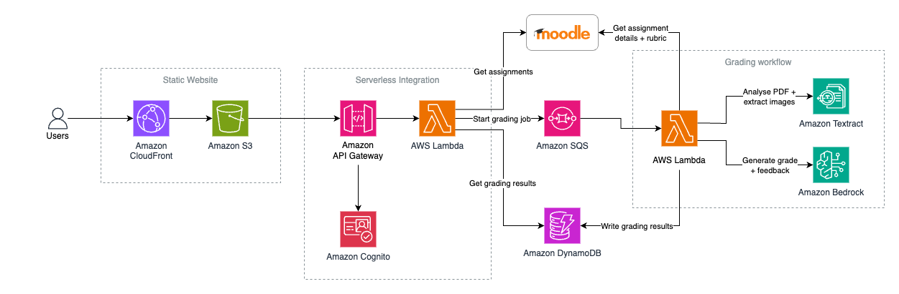

# AWS AI Grade Assistant Demo

This project provides an AI Grading Assistant that connects to Moodle and uses Generative AI to automatically grade student assignment.

## High Level Architecture



The main parts of the project are:

**1. Static Website**
Hosted on Amazon S3 and served through Amazon CloudFront. It is a [React](https://react.dev) application written in [Typescript](https://www.typescriptlang.org) and uses the [CloudScape design system](https://cloudscape.design).

**2. Serverless Integration**
The backend is connected to the front end via Amazon API Gateway. Amazon Cognito is used to control user access using the [OpenID Connect](https://openid.net/developers/how-connect-works/) protocol. AWS Lambda is used to orchestrate calls to down stream systems.

**3. Downstream**
The application uses Amazon Bedrock to invoke Large Language Models (LLMs) such as Anthropic Claude v3 to grade student assignment submissions. It retrieves the student submissions by integrating with Moodle and refers to configuration data that is stored in Amazon DynamoDB.

## Project structure

The project is split into 3 parts:

**1.** **[Back end CDK Project](/cdk)**
An AWS CDK (Cloud Development Kit) project which deploys all of the above infrastructure. It is a Typescript project.

**2.** **[Front end UI Project](/ui)**
A React single page app which provides the user interface (UI). It is a Typescript project.

**3.** **[Lambda functions](/lambda)**
The AWS Lambda functions are implemented using Python code.

## Getting started

From the main project directory:

1. ```npm install``` - install all dependencies.
2. ```npm run build``` - build the UI project.
3. ```npm run deploy``` - deploy the project to AWS.

Once the project has been deployed, look for an output parameter in your CloudFormation stack called ```WebsiteUrl```. Open this URL in your browser to access the application.

### Running the project locally

To run the UI locally: 

1. Deploy the CDK project (see instructions above)
2. After the CDK stack is deployed, a post deployment script will automatically generate a set of environment variables in `ui/public/config.js`. This allows your local UI server to connect to the deployed backend in AWS.
3. Run `npm start` to start the local UI server

### Removing the project

To remove the project from AWS, use ```npm run destroy```.


## License Summary

This sample code is made available under the MIT-0 license. See the LICENSE file.

## Disclaimer

Sample code, software libraries, command line tools, proofs of concept, templates, or other related technology are provided as AWS Content or Third-Party Content under the AWS Customer Agreement, or the relevant written agreement between you and AWS (whichever applies). You should not use this AWS Content or Third-Party Content in your production accounts, or on production or other critical data. You are responsible for testing, securing, and optimizing the AWS Content or Third-Party Content, such as sample code, as appropriate for production grade use based on your specific quality control practices and standards. Deploying AWS Content or Third-Party Content may incur AWS charges for creating or using AWS chargeable resources, such as running Amazon EC2 instances or using Amazon S3 storage.
